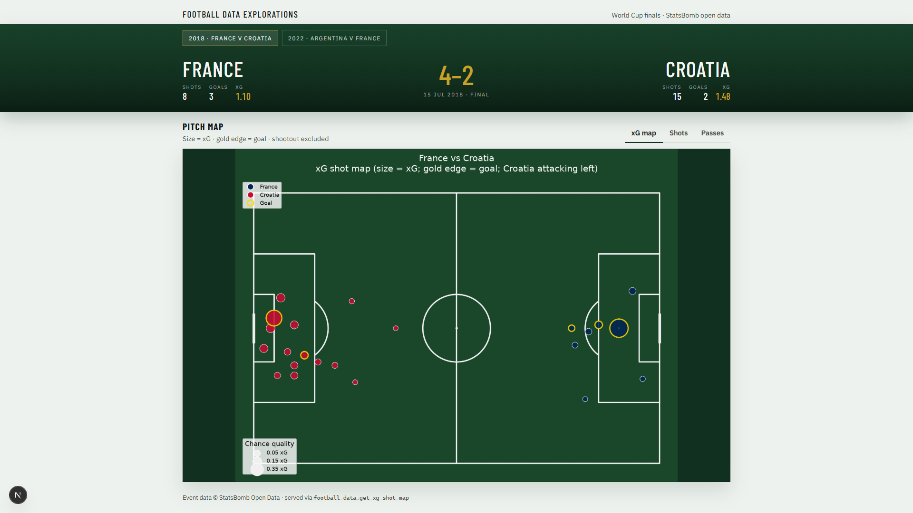

# Football Data Explorations

[](https://github.com/NoorSbeih/football-data-explorations/actions/workflows/ci.yml)
[](LICENSE)

StatsBomb open-data analysis packaged as an **importable, tested Python module** — not a
notebook dump — with a **FastAPI + Next.js** app on top so the analysis is reachable
from a browser, not just a script.



**Live demo:** [football-data-explorations.vercel.app](https://football-data-explorations.vercel.app) ·
API: [football-data-explorations.onrender.com](https://football-data-explorations.onrender.com/api/health)
(deployed on Vercel + Render's free tiers — see [`docs/DEPLOY.md`](docs/DEPLOY.md) for how; the
API may take ~30s to wake up on the first request after a period of inactivity)

## What this demonstrates

This started as a football side-project; the point of it now is the engineering, not the
fandom:

- **Package design** — analysis logic (`data.py` / `analysis.py` / `viz.py`) is decoupled
  from both the notebooks and the API, so the same function powers a Jupyter cell and an
  HTTP endpoint.
- **A real API layer** — FastAPI serving JSON tables and on-the-fly PNG pitch maps, with
  typed responses and proper 404s for unknown matches/players.
- **Tests, not vibes** — pytest suite covering the data/analysis/viz/API layers with
  mocked StatsBomb calls (no network in CI), plus lint (`ruff`) and a Next.js
  build/lint job, all gated in GitHub Actions.
- **A caching layer** — StatsBomb calls are cached to Parquet under `data/cache/` so
  repeat requests for the same match don't re-fetch; a first, small step toward the
  data-engineering side of this project.
- **Containerized** — `docker-compose up` runs the whole stack (API + UI) with no local
  Python/Node setup required.
- **A frontend that isn't a default template** — a custom "tactics board" UI consuming
  the API, not just `curl` output.

## Architecture

```
notebooks/  ──┐
              ├──►  src/football_data/  ──►  app/api (FastAPI)  ──►  app/web (Next.js)
CLI / scripts ┘        (data → analysis →           │ JSON + PNG            │ fetch()
                         viz, pure functions)        └──────────────────────┘
                              │
                              ▼
                    StatsBomb Open Data (GitHub)
                              │
                              ▼
                    data/cache/*.parquet  (local cache, gitignored)
```

`football_data` has no FastAPI or Next.js dependency — the API is a thin HTTP wrapper
around it, and either layer could be swapped without touching the analysis code.

## Showcase matches

Five finals spanning different competition formats, on purpose — the point is that
`showcase_matches()` generalizes past "the two World Cup finals it started with":

| Final | Competition |
|---|---|
| France 4–2 Croatia (2018) | FIFA World Cup |
| Argentina 3–3 France, on pens (2022) | FIFA World Cup |
| Tottenham Hotspur 0–2 Liverpool (2019) | UEFA Champions League |
| Italy 1–1 England, on pens (2021) | UEFA Euro 2020 |
| Spain Women's 1–0 England Women's (2023) | FIFA Women's World Cup |

## Layout

```
football-data-explorations/
├── notebooks/              # thin demos that call the package
├── src/football_data/      # importable loaders / analysis / viz
├── tests/                  # pytest — no network calls
├── app/
│   ├── api/                # FastAPI — JSON + PNG maps
│   └── web/                # Next.js pitchboard UI
├── docs/                   # screenshot + deploy notes
├── .github/workflows/      # CI (pytest + ruff + Next.js build/lint)
├── outputs/                # generated charts (gitignored, not committed)
├── Dockerfile.api / app/web/Dockerfile / docker-compose.yml
├── pyproject.toml
├── requirements.txt
└── README.md
```

## Setup

```powershell
python -m venv venv
.\venv\Scripts\Activate.ps1
python -m pip install --upgrade pip
pip install -r requirements.txt
```

`requirements.txt` editable-installs this repo (`pip install -e .`) and pulls in
FastAPI, Jupyter, and the dev/test tooling (pytest, ruff).

## Run the mini-app

**Locally, two terminals:**

```powershell
# API (repo root, venv on)
uvicorn app.api.main:app --reload --port 8000

# UI (second terminal)
cd app\web
npm install
npm run dev
```

Open http://localhost:3000 — pick a final, inspect xG / shots / passes.

**Or with Docker (no local Python/Node needed):**

```powershell
docker compose up --build
```

Same URLs (`:8000` for the API, `:3000` for the UI). See
[app/README.md](app/README.md) for the full API route table.

## Tests & CI

```powershell
pytest --cov=football_data --cov-report=term-missing   # 24 tests, ~88% coverage
ruff check src tests app/api                            # lint
```

Every push/PR runs this plus a Next.js `lint` + `build` job in
[`.github/workflows/ci.yml`](.github/workflows/ci.yml) — no test in the suite touches
the network; StatsBomb calls are monkeypatched.

## Notebooks

```powershell
jupyter notebook notebooks\01_explore_wc_final.ipynb
jupyter notebook notebooks\02_xg_two_finals.ipynb
```

## From Python

```python
from pathlib import Path
from football_data import world_cup_2022_final, get_xg_shot_map

match = world_cup_2022_final()
get_xg_shot_map(match, save_path=Path("outputs") / f"wc2022_final_{match.match_id}_xg_shots.png")
```

## Data credit

Event data from [StatsBomb Open Data](https://github.com/statsbomb/open-data). Follow
their license and attribution if you publish charts. This repository's own code is
MIT-licensed (see [LICENSE](LICENSE)).
